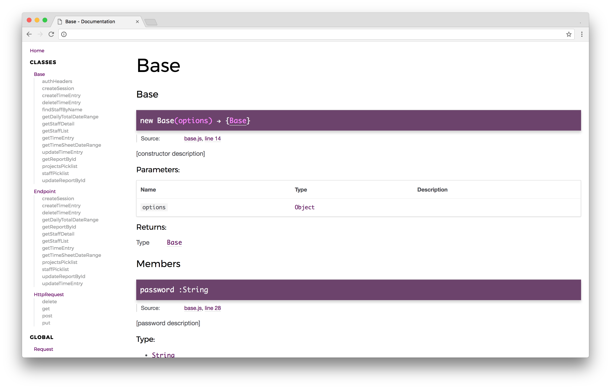

# BigTime SDK
Node wrapper for interacting with the [BigTime API](http://iq.bigtime.net/BigtimeData/api/v2/help/Overview).

[](https://travis-ci.org/john-goldsmith/bigtime-sdk)
[](https://badge.fury.io/js/bigtime-sdk)
[](https://codeclimate.com/github/john-goldsmith/bigtime-sdk/maintainability)
[](https://codeclimate.com/github/john-goldsmith/bigtime-sdk/test_coverage)
[](https://coveralls.io/github/john-goldsmith/bigtime-sdk?branch=master)
[](https://david-dm.org/john-goldsmith/bigtime-sdk)

## Installation

`npm install --save bigtime-sdk`

## Usage

```js
const BigTime = require('bigtime-sdk');

const bigTime = new BigTime({
  username: YOUR_USERNAME_HERE,
  password: YOUR_PASSWORD_HERE
});

bigTime.createSession()
  .then(
    response => {
      // Do stuff with the response
      return bigTime.getStaffList();
    }
  )
  .then(
    response => {
      // Do stuff with the response
    }
  )
```


## Tests

`npm test`

```
-------------------------|----------|----------|----------|----------|----------------|
File                     |  % Stmts | % Branch |  % Funcs |  % Lines |Uncovered Lines |
-------------------------|----------|----------|----------|----------|----------------|
All files                |      100 |      100 |      100 |      100 |                |
 src                     |      100 |      100 |      100 |      100 |                |
  base.js                |      100 |      100 |      100 |      100 |                |
  endpoint.js            |      100 |      100 |      100 |      100 |                |
  http-request.js        |      100 |      100 |      100 |      100 |                |
 src/util                |      100 |      100 |      100 |      100 |                |
  get-current-date.js    |      100 |      100 |      100 |      100 |                |
  index.js               |      100 |      100 |      100 |      100 |                |
  populate-url-params.js |      100 |      100 |      100 |      100 |                |
-------------------------|----------|----------|----------|----------|----------------|
```

## Documentation

`npm run docs`



## Linting
Refer to the [ESLint docs](https://eslint.org/docs/rules/) and [.eslintrc.json](./.eslintrc.json) for rules.

`npm run lint`

## To Do
- [ ] Normalize `HttpRequest[method]` signatures
- [ ] Use `async`/`await`
- [ ] Namespace resources (`bigTime.picklists.staff()`, etc.)
- [ ] Add timer endpoints
- [ ] Add weekly start date endpoints
- [ ] Add expense endpoints
- [ ] Add projects endpoints
- [ ] Add tasks endpoints
- [ ] Add invoice endpoints
- [ ] Add transaction endpoints
